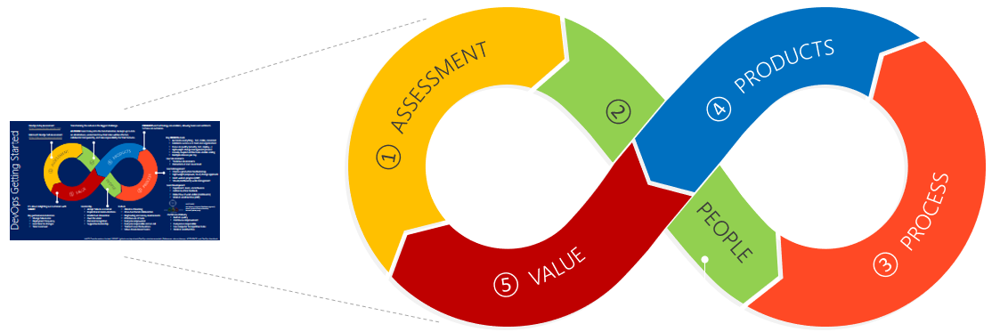
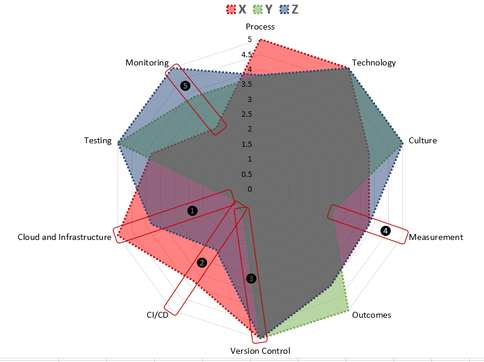

> Summary
> Step 1 - Assessments benchmark you against the rest of the industry. They help you understand where you are doing well, where improvements are possible, and what to focus on.

# Start by assessing your DevOps mindset and performance

Organizations are under pressure to maintain a competitive advantage in an age where users demand relevant and high-quality solutions. Users are quick to switch solutions if the initial experience is poor, or time to market is slow. You snooze, you loose!

Adopting a [DevOps](http://donovanbrown.com/post/what-is-devops) mindset helps to increase profitability, improve productivity, deliver continuous value, and most importantly, delight end-users. However, the digital transformation is no trivial feat and introduces risk to the organization, teams, and individuals.

In the [DevOps Mindset Essentials](https://github.com/wpschaub/DevOps-mindset-essentials), we focus on five steps to get **getting started**, to continuously experiment, reflect, and adjust along the way. 

You probably have a few questions, such as:

- How do you get started with your journey?
- How can you assess how you compare to the rest of the industry?

To mitigate risk to the business, explore the transformation in a pragmatic step-by-step journey ("peel an onion" vs "boil the ocean") start with one or two teams, not the entire organization. They will eventually become the **lighthouse** (or beacon of inspiration) to the rest of the organization, help promote the DevOps mindset, and enable others to transform.

## Step 1 - **ASSESSMENT**.

Assessments benchmark you against the rest of the industry. They help you understand where you are doing well, where improvements are possible, and what to focus on. Two popular assessments are the [Dora](https://www.devops-survey.com/) and the free [Microsoft](https://aka.ms/devopsassessment) DevOps Assessments.

It's interesting and invaluable to get a view of how your leadership assess their organization (top down) and how the teams assess themselves (bottom up) by both completing one of the assessments, for example the [Microsoft](https://aka.ms/devopsassessment) DevOps assessment. 

At a glance, there "appears" to be consensus with technology and version control (1). On the other hand, there is a divergence with Continuous Integration/Deployment (2), Cloud and Infrastructure (3), Measurement (4), and Monitoring (5). These are areas of "potential" improvement.

I used the words "appears" and "potential", because the assessments are subjective, and the findings need to be proven or disproven through further analysis and observations.

Ask the teams a few more questions using crisp and anonymous surveys. 

> Place of work

- Would you recommend your organization as a place to work to a friend or colleague? 
- Would you recommend your team as a place to work to a friend or colleague?

The results will identify the percentage of promoters, passive members, and distractors. It is important to move passive team members to promoters and to ensure that we have no distractors - they radiate a negative energy and can be toxic to the transformation.

> Culture

Ask teams to agree or disagree with questions such as recommended in the [ACCELERATE](http://a.co/inRSwnz) book to better understand their culture: 

- Information is actively sought? 
- Messengers are not punished when they deliver news of failures or other bad news? 
- Responsibilities are shared? 
- Cross-functional collaboration is encouraged and rewarded? 
- Failure causes inquiry? 
- New ideas are welcome? Failures are treated primarily as opportunities to improve the system?

> Process

Last, but not least, do some prodding in terms of the engineering process. 
- What are the teams [key performance indicators](https://willys-cave.ghost.io/4-four-of-the-key-performance-indicators-kpi-we-need-to-continuously-improve/)?
- How painful are their deployments?

## Conclusion

After step (1) - **ASSESSMENT**, you have assessed and compared the organization and teams with the rest of the industry. You have highlighted areas of improvement and most importantly, have kick-started the process of continuous learning and innovation.

The leadership has a powerful influence on the digital transformation. It's important they: 

- Are committed to the transformation, supportive of the innovations, and inspirational to "infect" everyone with the DevOps mindset.
- Own a clear vision of why and where the organization is going.
- Inspire, motivate, and encourage everyone to think out of the box. 
- Promote a climate of learning, experimentation, and recognition of engineering, team, and personal improvements.

> DevOps isn’t a destination, it’s a journey of continuous and rapid innovation.

## Call to action, to prepare for step (2) - **PEOPLE**:

> Leadership 

- Define a vision for the transformation. 
- Identify a champion or team of champions that will be the center of excellence (CoE) and point-of-contact during the digital transformation.
- Update everyone in the organization on the digital transformation, planned initiatives, and elaborate how their roles may be affected. 

> Teams 

- Explore strategies for everyone to take responsibility for the team's solutions and be trained to run the business. 
-Start thinking about the high-level process blocks for the team's value stream, such as the code review, test, security review, change approval, and deployment processes. Define the total lead time and value added time for each process block. Read [Value Stream Mapping for our VSTS Extensions](https://blogs.msdn.microsoft.com/visualstudioalmrangers/2018/01/25/value-stream-mapping-for-our-vsts-extensions/), [Post 2- Value Stream Mapping for ALM Ranger’s VSTS Extensions Work Stream](https://blogs.msdn.microsoft.com/visualstudioalmrangers/2018/02/16/post-2-value-stream-mapping-for-alm-rangers-vsts-extensions-work-stream/), and [Value Stream Management](https://www.tasktop.com/value-stream-management) for more information. 
- Start thinking about a list of products used by the team. Identify tools to investigate and elaborate how to use the tools more effectively. For a list of categories and products, review and update the [DevOps Technology](https://github.com/wpschaub/DevOps-mindset-essentials/blob/master/src/posters/devops-mindset-essentials-gdbc-technology.pdf) poster. 

## References

- [ACCELERATE book](http://a.co/inRSwnz), by Nicole Forsgren, Jez Humble, and Gene Kim 
- [DevOps Assessment](https://aka.ms/devopsassessment) 
- [DevOps Getting Started](https://github.com/wpschaub/DevOps-mindset-essentials/blob/master/src/posters/devops-mindset-essentials-gdbc-getting-started.pdf) poster 
- [DevOps Handbook](http://a.co/6pzeYE1), by Gene Kim, Jez Humble, Patrick Debois, and John Willis 
- [DevOps Mindset Essentials]https://github.com/wpschaub/DevOps-mindset-essentials) 
- [DevOps Technology](https://github.com/wpschaub/DevOps-mindset-essentials) poster
- [Value Stream Mapping for our VSTS Extensions](https://blogs.msdn.microsoft.com/visualstudioalmrangers/2018/01/25/value-stream-mapping-for-our-vsts-extensions/)
- [Post 2- Value Stream Mapping for ALM Ranger’s VSTS Extensions Work Stream](https://blogs.msdn.microsoft.com/visualstudioalmrangers/2018/02/16/post-2-value-stream-mapping-for-alm-rangers-vsts-extensions-work-stream/)
- [Value Stream Management](https://www.tasktop.com/value-stream-management), by TaskTop 
- [What Is a Vision Statement?](https://www.businessnewsdaily.com/3882-vision-statement.html), by Paula Fernandes