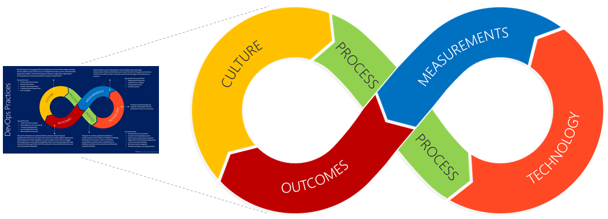
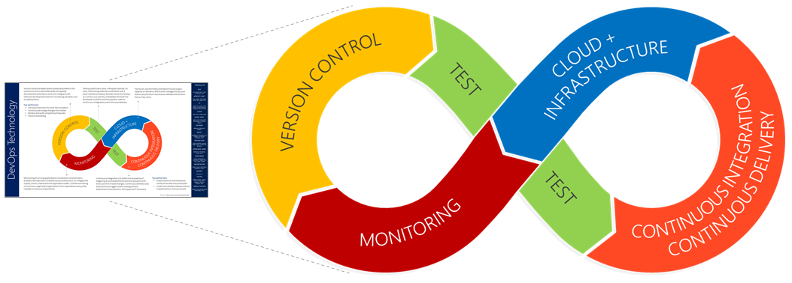
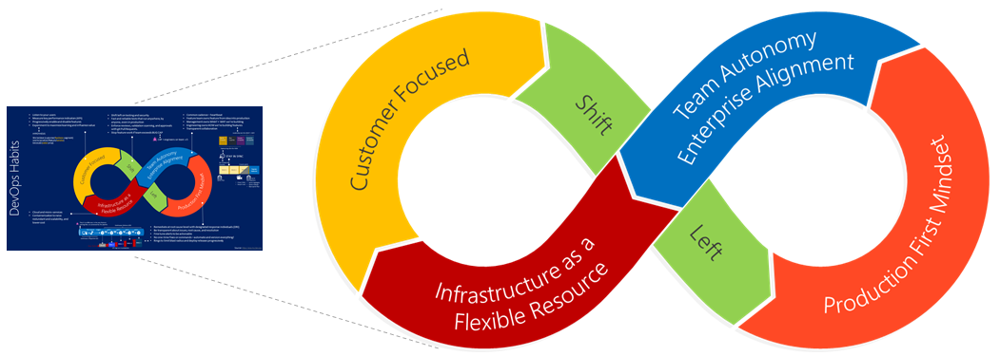

# Visualizing a DevOps Essentials Mindset

>
> THIS IS AN EARLY DRAFT - TECHNICAL AND COPY EDITING PENDING!
>

Organizations are investing in a move from resource optimized model, based on capital expenses (CAPEX), to a market optimised business model, based on operational expenses (OPEX). It's about **time to market** and continuously **delighting customers** with value! 

Welcome to digital transformations, embracing a **DevOps** mindset in your oganisation! 

As defined by [Donovan Brown](http://donovanbrown.com/post/what-is-devops), "DevOps is the union of **people**, **process**, and **products** to enable continuous delivery of value to our end users." 

> DevOps is not about magical unicorns and colorful rainbows. It's a journey of continuous learning and improvement, with a destination you never quite get to! It's the reason that all of the images herein, are based on the infinity symbol.
>
> 

None of this is new to you, you're eager to explore DevOps, and probably asking yourself "**how do we get started?**" 

Being a visual minded person, I created a [presentation with posters](https://github.com/wpschaub/DevOps-mindset-essentials/blob/master/src/presentations/devops-mindset-essentials-gdbc.pdf) to seek answers for the recently hosted [Global DevOps Bootcamp (GDBC)](https://globaldevopsbootcamp.com). It's an annual community driven event, hosted around the globe on the same day, to create an environment in which we can collaboratively explore digital transformations and DevOps insights.

Let's explore four of the quick reference [posters](https://github.com/wpschaub/devOps-mindset-essentials/posters), also referred to as visuals and infographics. For a more in-depth discussion of DevOps, refer to the [DevOps Handbook](http://a.co/92KSNxJ), by Gene Kim, Jez Humble, Patrick Debois, and John Willis. 

## Practices

The first two posters are based on the [DevOps Assessment](https://aka.ms/devopsassessment) and intended to be used when reviewing the assessment results with all stakeholders. The first introduces five key **pactices**.

Top performers encourage a **culture** that fosters a growth mindset, reward innovation, collaboration, experimentation, learning, and user empathy. Strive for a **process** with a responsive application delivery, flexible scheduling, and iterative experiments. Monitor, identify and mitigate issues, and continuously elliminate wasteful bottlenecks. Only valuable key performance indicators are **measured** and used to strive for better **outcomes**, such as a low change failure rate (CFR), minimal time to recover (MTTR), and remediation of issues at root level. Lastly, **technology**, which is an enabler, is the focus of the next poster. 

## Technology

Here's a companion of the **practices** poster, focused on **technology**.

**Version control** manages versions of your application, configuration, infrastructure, and other code. It enables team collaboration and monitoring activities, such as deployments. Top performers use topic branches for short-term isolation, continuously merge changes into master, review and audit using Git pull requests, and version everything. **Testing** must be viewed as a continuous activity, embedded into both the developer workflow and the **coLntinuous integration** (CI) and **continuous delivery** (CD) pipeline. The **Cloud** enables you to effectivey provision your **infrastructure** and move as fast as they need. Lastly, **monitoring** enables you to form a hypothesis, validate or disprove experiements, pro-actively detect issues as they occur, and understand the application health.

The blue bar on the right of the poster lists **products** to consider when you're investigation technology for your development, production, common engineering, and other environments. Provide feedback on the listed products and regularly update your poster to always have the latest of a volatile and opinionated part of the visual! 

## Habits

Based on the [Moving 65,000 engineers to DevOps with VSTS](https://www.slideshare.net/WillyPeterSchaub/devconf-moving-65000-microsofties-to-devops-with-visual-studio-team-services) story, this poster is focused on the five key habits we learned about during our transformation. The **customer focused**, **team autonomy ad enterprise alignment**, and **shift left** habits are really evolutions of Agile, and the **production first mindset** and **infrastructure as a flexile resource** particular to a DevOps mindset. 

For Agile++, **Customer Focused** is part of our quest for delighted customers and our obsession for customer value. You need to actively listen to your users, progressively enable and disable features, perform continuous experiments, and measure key performance indicators. It's important to use all available feedback to maximise learnings and influence value. **Shift Left** encourages reviews, validations, and approvals for both testing ans security as early as possible in the feature delivery cycle to drive quality and a fail-fast mindset. When technical debt exceeds a predefined limit (for example a 5 bugs per engineer bug cap) that you're comfortable with, feature teams should encouraged to suspend feature work until the technical debt is paid down. **Team Autonomy and Enterprise Alignment** is concerned with how we build what, and why. There's a need for a common cadence, or heartbeat, across your organization to enable all your leadership and feature teams to collaborate transparently and effectively. A core learning is that the most effective feature teams are those that own a feature from idea to production, with autonomy how they develop and support their features.

For your DevOps, **production first** is a mindset that differentiate how features and bugs are handled during development, testing, and operational support. Everything should be automated, versioned, and fined tuned in production. Lean on [ring based deployments and rings](https://opensource.com/article/18/2/feature-flags-ring-deployment-model) to limit your blast radius of feature changes in production, remdiate all issus at root cause level, and remember to be transparent about issues, root cause, and resolution. As a user I'll be far more understanding if I have an insight into issues. **Infrastructure as a flexible resource** is a new buzzword that describes how solution architectures are adapted to the cloud, containerisation, and microservices. It's important to adopt a pragmatic transformation, in a way that makes sense for your organisation, goals, products, and culture. As with the previous habits, it's important to favour autonomy over a descriptive architecture, and not to transform everything all at once. 

## Getting Started

The last visualization we'll cover in this overview, pulls together all of the above and proposes five steps to getting started with DevOps. Whether you tackle the steps all at once ("big bang"), step-by-step ("peel an onion"), or gradually innovate your value chain across all steps ("broad spectrum innovation") is your choice. As before, just be pragmatic!

Personally, I prefer to start with step one, **assessment**, then tackle the remainder based on the results and identified value-chain hotspots and bottlenecks. 

- **Assessments** give you a benchmark of your DevOps mindset and performance against the rest of the industry. It's important to nderstand where you're doing well and where investment will help you transform to the next level. Both the [Dora](https://www.devops-survey.com/) and [Microsoft](https://aka.ms/devopsassessment) DevOps Assessments are great starting points.       
- **People** and culture is your biggest challenge. Everyone needs to buy into the transformation, understand how they will be affected, encourage transparency, be engaged, and take full responsibility for their value streams. This incudes the leadership, who need to be supportive, inspirational, empowering, and drive a clear vision. You'll make or break the transformation as a team!
- **Process** is your engineering system that enables the teams to manage live site incidents, use lean management and development, and continuously deliver value. A common engineering system will introduce consistency, empower feature teams, and enable and encourage everyone to support and contribute each other. Your top process goals should include a focus on quality, a loosely coupled architecture to enable scaling, lightweight management, automation, multiple releases per day, and celebration of success as a team and as an organization.  
- **Products** are the easiest link in the chain. They enable everyone to focus on what's important - delivery of value to the end users!
- **Value** is all about delighting users! Key performannce indicators to measure value include deployment frequency, lead time for changes, change failure rate, and time to recover.   

XXXTBDXXX

> **Improvement Is Possible for Everyone**, if leadership provides consistent support, and team members commit themselves to the work. - [ACCELERATE book](https://t.co/smb82Y4i0M), by Nicole Forsgren, Jez Humble, and Gene Kim.

XXXTBDXXX

Which visuals you would like to see (innovate)? Which visuals add no value (deprecate)? Let's [collaborate](https://github.com/wpschaub/devOps-mindset-essentials) to facilitate visuals and guidance to help demistify DevOps and make you and your users shine! Users need a positive feeling that they can rely on proven practices, real-world learnings, and that they are not alone.

Looking forward to your feedback and pull requests!