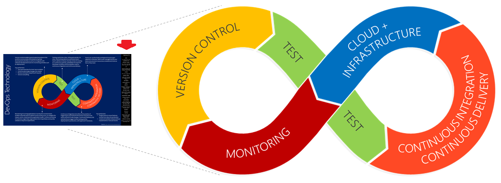
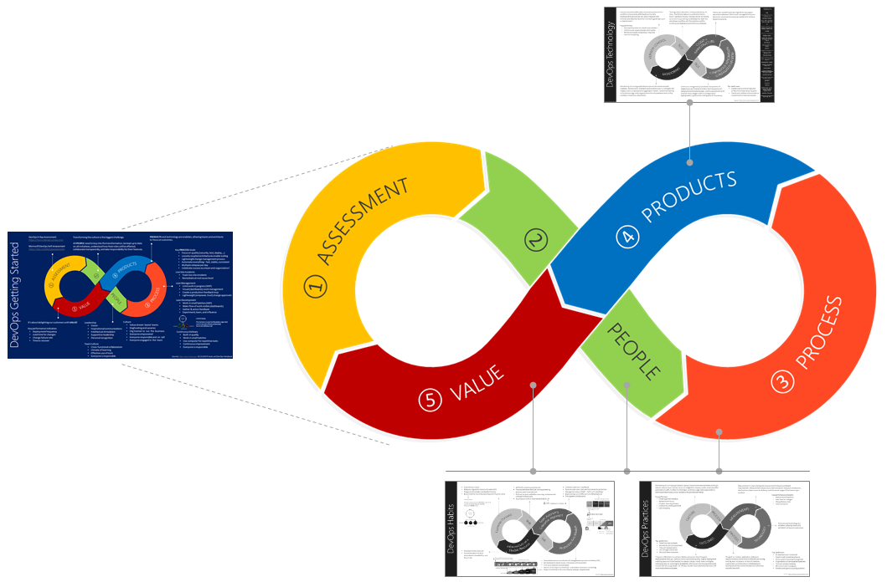

# Visualizing a DevOps Essentials Mindset

Organizations are investing in a move from resource optimized model, based on capital expenses (CAPEX), to a market optimised business model, based on operational expenses (OPEX). It's about **time to market** and continuously **delighting customers** with value! 

Welcome to digital transformations with a **DevOps** mindset! 

As defined by [Donovan Brown](http://donovanbrown.com/post/what-is-devops), "DevOps is the union of **people**, **process**, and **products** to enable continuous delivery of value to our end users." 

> DevOps is not about magical unicorns and colorful rainbows. It's a journey of continuous learning and improvement, with a destination you never quite get to! It's the reason that all of the images herein, are based on the infinity symbol.
>
> 

None of this is new to you, you're eager to explore DevOps, and probably asking yourself "**how do we get started?**" 

Being a visual person, I created a [presentation and posters](https://github.com/wpschaub/DevOps-mindset-essentials/README.md) to seek answers for the recent [Global DevOps Bootcamp (GDBC)](https://globaldevopsbootcamp.com). It's an annual community driven event, hosted around the globe on the same day, to create an environment in which we can collaboratively explore digital transformations and DevOps insights.

Let's explore the four quick reference posters, also referred to as visuals and infographics. For a more in-depth exploration of DevOps, refer to the [DevOps Handbook](XXX), by XXX, XXX, and XXX. 

## Practices

XXX

## Technologies

XXX

## Habits

XXX

## Getting Started

XXX

> Improvement Is Possible for Everyone, if leadership provides consistent support, and team members commit themselves to the work. - [ACCELERATE book](https://t.co/smb82Y4i0M), by Nicole Forsgren, Jez Humble, and Gene Kim.

XXX

Which visuals you would like to see (innovate)? Which visuals add no value (deprecate)? Let's [collaborate](https://github.com/wpschaub/devOps-mindset-essentials) to facilitate visuals and guidance that will help demistify DevOps and make you and your users shine! Users need a positive feeling that they can rely on proven practices, real-world learnings, and that they are not alone.

Looking forward to your candid and actionable feedback!