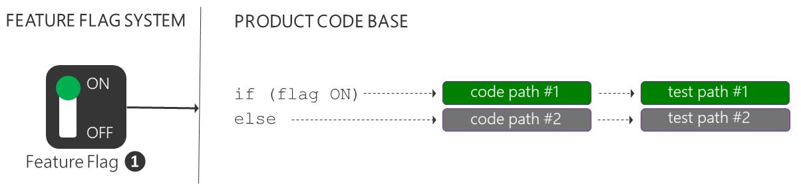
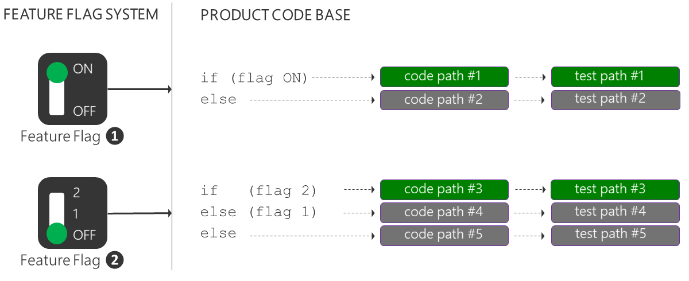
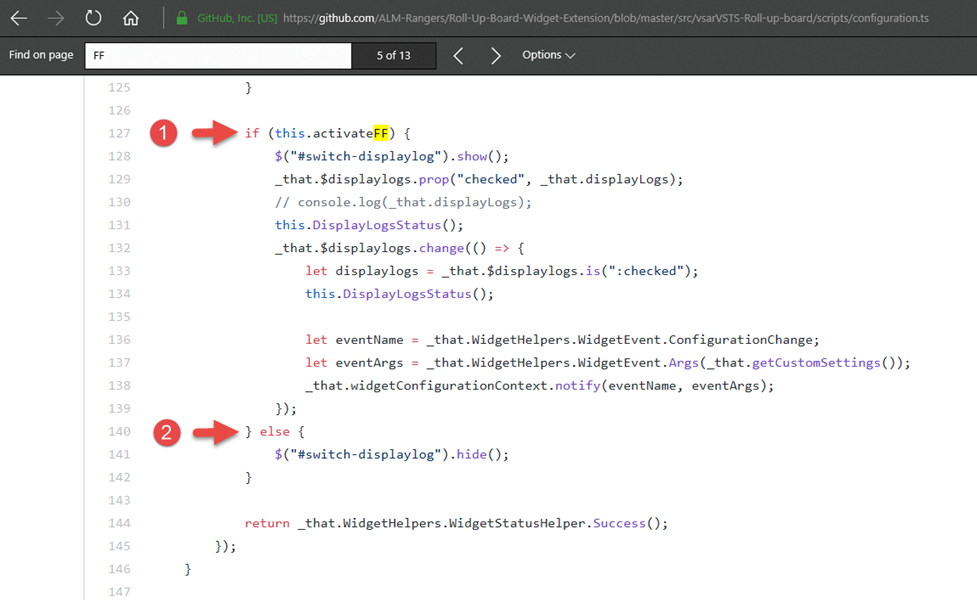

# Progressive Exposure come at a cost

In the [Deploying new releases: Feature flags or rings?](XXXXXX) article we introduced feature flags and ring-based deployments, both enablers for the DevOps pactice of progressive exposure. 

Progressive exposure enables us to mitigate impact of changes as they occur, perform iterative experiments, assess features, and get rapid feedback on every change, all in production. Using feature flags, for example, you can effectively perform short-lived experiments, isolate unfinished work, fine-tune continuous releases, dynamically manage long-lived operational configurations and permissions.   

It's a practice that not only leads to happy customers, but enables us to create effective and motivated feature teams. 

You're probably asking yourself "what's the catch?" 

For **ring-based deployments** your primary cost is to manage the production environments covered by the rings with a "production first" mindset. You need to minimise the "bast radius" for each release, monitor each release and mitigate root issues quickly. For **feature flags** you need to manage your feature flag product, manage technical debt, and develop an insight into the implications of simply "flipping a flag".

Let's explore some of the costs of feature flags.

## Product investment and operational cost

You need to investigate and find the right feature flag solution for your environment. Some important considerations include seamless integration with your DevOps process and products, simple and cost-effective management of flags, ability to perform an emergency roll-back, and support for auditing, fine-tuned permissions and security. For example, if you're managing feature flags down to a specific user, you're likely capturing personal information and entering the realm of the new [Global Data Protection Regulation (GDPR)](XXXXX).

**Don't build your own custom solution!** There are enough options such as the [FEATURE TOGGLE](XXX), [FLIPIT](XXXXX), and [XXXX]() open source frameworks, and software as a service (SaaS) such as [LaunchDarkly](https://www.launchdarkly.com). With the latter, you delegate maintenance, updates, and infrastructure to your SaaS provider - you can focus your product features and deliver value to your customers.

 // https://blogs.msdn.microsoft.com/visualstudioalmrangers/2017/04/04/how-to-implement-feature-flags-and-ab-testing/

## Technical Debt

XXXXXXXXXXXXXXXX EACH IF-ELSE PATH REQUIRES TESTS + INTRODUCES DEPENDENCIES

XXXXXXXXXXXXXXXX EACH IF-ELSE PATH INTRODUCES CODE DEBT - MAINTAIN YOUR CODE, REMOVE AS SOON AS NOT NEEDED

## Understanding of the implications of flipping a flag

There's one more important cost you need to consider. Flipping a feature flag is simple, the change ripples through production quickly, and your users start using your new feature with excitement. You're confident with the feature you just enabled, but do you have an understanding of all the side-effects of flipping the flag?

There are two experiences which we often share, which demonstrate that even with the best process, we have had really bad days, resulting in disappointed customers.

> DEVOPS = INFINITE LEARNING JOUNEY!X XXXXXXXXXXXXXXXXXXXXXX

XXXXXXXXXXXXXXXX FLIP AND EVALUATE "EVENT" FLAGS A FEW DAYS BEFORE YOUR KEYNOTE

It's important to have user empathy and to be transparent about issues, root cause, and resolution of bad days as described. Users with an insight are typically more tolerant and supportive of your continuous journey of learning and innovation.

Once you are cognisant of and manage the risks and costs, your feature teams will be able to progressively expose releases using ring-based deployments, and fine-tune them using feature flags. 

Enjoy observing motivated feature teams and more importantly, happy customers!

References - [A Rough Patch](https://aka.ms/bh-ff-sos), [Continuous Delivery by Jez Humble](https://www.continuousdelivery.com/), [Feature Toggles by Martin Fowler](https://martinfowler.com/bliki/FeatureToggle.html), [How we checked and fixed the 503 error and performance issue in our Azure Function](https://aka.ms/vsar-ff-sos), [Moving 65,000 engineers to DevOps](https://aka.ms/devops), [Phase the features of your application with feature flags](https://docs.microsoft.com/en-us/vsts/articles/phase-features-with-feature-flags), and [Phase the roll-out of your application through rings](https://www.visualstudio.com/en-us/articles/phase-rollout-with-rings). 