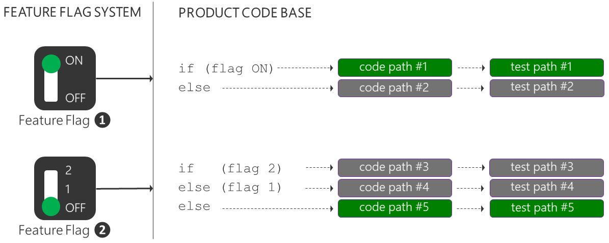
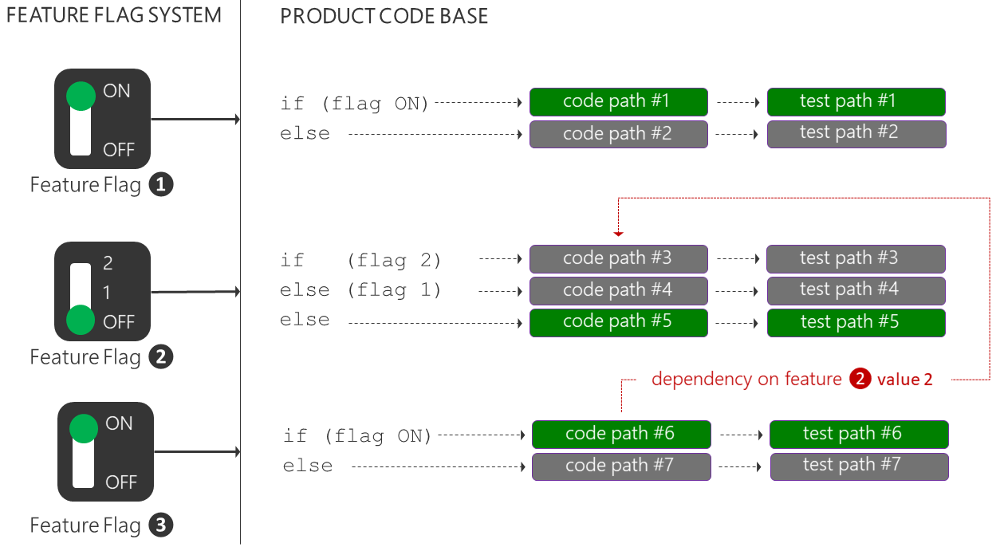
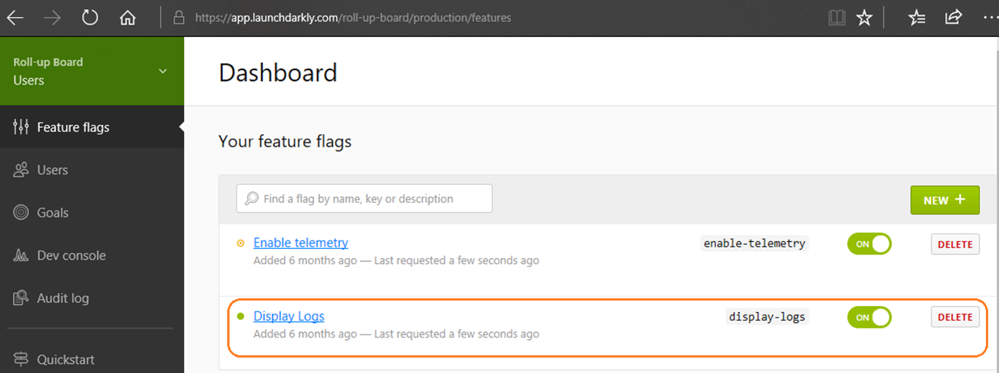
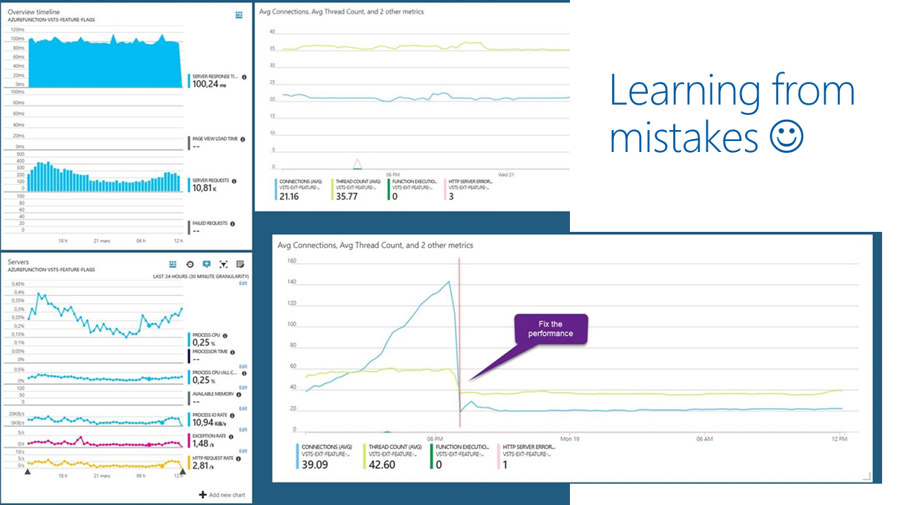

# Does Progressive Exposure really come at a cost?

In [Deploying new releases: Feature flags or rings](XXXXXX) we introduced feature flags and ring-based deployments, both enablers for the DevOps practice of progressive exposure. 

Progressive exposure enables us to mitigate impact of changes as they occur, perform iterative experiments, assess features, and get rapid feedback on every change - all in production. Feature flags, for example, enable you to perform short-lived experiments, isolate unfinished work, fine-tune continuous releases, dynamically manage long-lived operational configurations and permissions.   

It's a practice that not only leads to happy customers, but enables us to create effective and motivated feature teams. 

You're probably asking yourself "**what's the catch?**" 

For **ring-based deployments** your primary cost is to manage the production environments covered by the rings with a "production first" mindset. You need to minimise the "blast radius" for each release, monitor each release and mitigate root issues quickly. For **feature flags** you need to manage your feature flag product, manage technical debt, and develop an insight into the implications of simply "flipping a flag".

Let's explore some of the costs of feature flags.

## Product investment and operational cost

You need to investigate and find the right feature flag solution for your environment. Some important considerations include seamless integration with your DevOps process and products, simple and cost-effective management of flags, ability to perform an emergency roll-back, and support for auditing, fine-tuned permissions and security. For example, if you're managing feature flags down to a specific user, you're likely capturing personal information and entering the realm of the new [Global Data Protection Regulation (GDPR)](XXXXX).

**Don't build your own custom feature flag solution!** There are enough options such as the [Feature Toggle](https://github.com/jason-roberts/FeatureToggle), [NFeature](https://github.com/benaston/NFeature), [FeatureSwitcher](https://github.com/mexx/FeatureSwitcher), [Togglz](https://github.com/togglz/togglz), and [FF4J](https://github.com/clun/ff4j) frameworks, and software as a service (SaaS) such as [LaunchDarkly](https://www.launchdarkly.com). With the latter, you delegate maintenance, updates, and infrastructure to your SaaS provider - you can focus your product features and deliver value to your customers.

## Technical Debt

With feature flags we break up a product into independent parts that can be released separately, giving our feature teams and business control over who gets which feature and when. By breaking up your product you're adding a level of complexity, which needs maintenance to avoid stale flags and associated code.

For example, when we add a simple ON|OFF feature flag to isolate a feature, we're adding an **if-else** code construct, and **doubling** our code and test paths, as shown below. If it's an experimental feature flag, it's lifespan is typically weeks, after which it needs to be removed to avoid technical debt. For other feature flags the lifespan may be longer, however, the same principle applies "remove the feature flags and associated code as soon as you do not need them."  

When we add a multi-value OFF|1|2 feature flag, we **multiply** the feature code and test paths. After adding two feature flags we are maintaining two features, with five code and test paths. Every path needs to be validated and tested with every change, as we have no guarantee when a feature flag will be toggled.

But there's more! Let's add another simple ON|OFF feature flag for a new feature for which we would like to collect telemetry, to examine a hypothesis. It again **doubles** the feature code and test paths, incrementing the paths that need to be validated to seven. More importantly it introduces a dependency on a specific version of the second feature. Do we wait for the dependency to be enabled? Do we rely on an isolated and potentially incomplete feature? Who ensures that a feature flag is not inadvertently toggled to satisfy a dependency? Great questions, which need to be answered as part of your process transformation, to encourage flexible scheduling, iterative experiments, and close team collaboration to facilitate real-time ownership and management of these challenges. 

Imagine a product with hundreds of feature flags. How do you identify stale feature flags and associated code and test paths adding to our technical debt (cost)? How do you convince your feature teams to **change** and **remove** code from a fully functional product? The feature teams need to own the feature from sunrise (idea) to sunset (deprecate), use a common engineering process, and apply consistent code and naming conventions. Identifying and removing stale feature flags and code must be simple.  

Let's have a quick look at an extract from the [Roll-up Board](https://github.com/ALM-Rangers/Roll-Up-Board-Widget-Extension) extension, which shows the ON and OFF code paths for a feature flag that checks the value of **activateFF**.

In the feature flag admin system, the feature has a friendly display name **Display Logs** and **display-logs** flag.

At a glance the relationship between **activateFF** and **display-logs** is not obvious. As an engineer, I'm reluctant to make changes to the code without further investigation (cost).  

## Understanding of the implications of flipping a flag

There's one more important cost you need to consider. Flipping a feature flag is simple, the change ripples through production quickly, and your users start using your new feature with excitement. You're happy with the feature you just enabled, but are you confident that you have an understanding of all the side-effects of flipping the flag?

There are two experiences we often share, which demonstrate that even with the best process, we have had really bad days, resulting really bad customer experiences.

- [A Rough Patch](https://aka.ms/bh-ff-sos) - The team flipped a feature flag at a big marketing event, when Corporate Vice President, Brian Harry, was on stage. As described in the blog post, it didn’t go well. The product experienced unexpected authentication failures and eventually buckled under load.

- [How we learned about the 503 meltdown](https://aka.ms/vsar-ff-sos) - The team enabled feature flags in one of their most popular extensions. Users experienced 503 errors, followed by severe performance issues, and eventually the Azure Functions handling feature flags failed under load. 

In both bases you'll read that there was a "failure under load". It's important to flip a feature flag in a Canary or Early Adopter environment and simulate anticipated loads a few days before flipping the feature flag for all users. This is particularly true for big marketing events where first impressions count.

A solid engineering process and live telemetry enabled us to detect the issues as they occurred, identify the root cause, and mitigate the impact. 

  

> DevOps is a journey of continuous learning and improvement, with a destination you never quite get to!

It's important to learn from these mistakes, explore potential implications, have user empathy, and be transparent about issues, root cause, and resolution of bad days. Users with an insight are typically more tolerant and supportive of your continuous journey of learning and innovation.

Once you are cognisant of and manage the risks and costs, your feature teams will be able to progressively expose releases using ring-based deployments and fine-tune them using feature flags. 

Enjoy observing motivated feature teams and more importantly, happy customers!

References - [A Rough Patch](https://aka.ms/bh-ff-sos), [Continuous Delivery by Jez Humble](https://www.continuousdelivery.com/), [Feature Toggles by Martin Fowler](https://martinfowler.com/bliki/FeatureToggle.html), [How we checked and fixed the 503 error and performance issue in our Azure Function](https://aka.ms/vsar-ff-sos), [Moving 65,000 engineers to DevOps](https://aka.ms/devops), [Phase the features of your application with feature flags](https://docs.microsoft.com/en-us/vsts/articles/phase-features-with-feature-flags), and [Phase the roll-out of your application through rings](https://www.visualstudio.com/en-us/articles/phase-rollout-with-rings). 