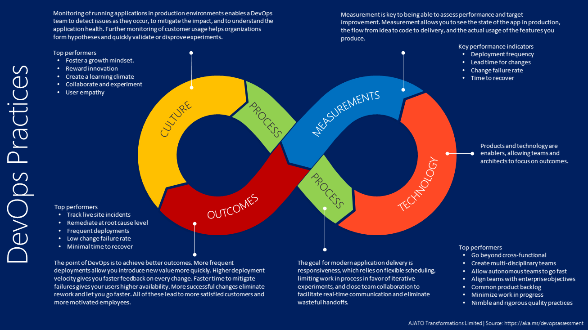
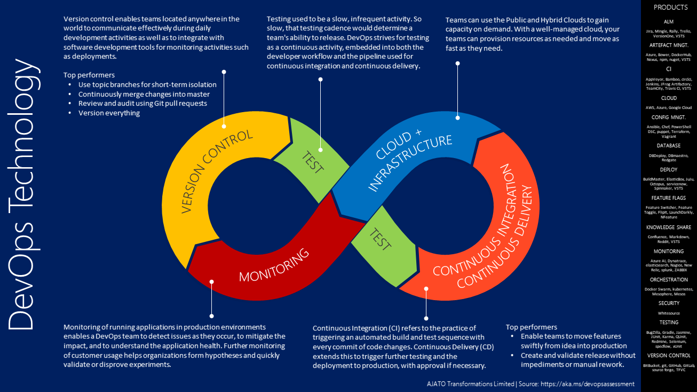
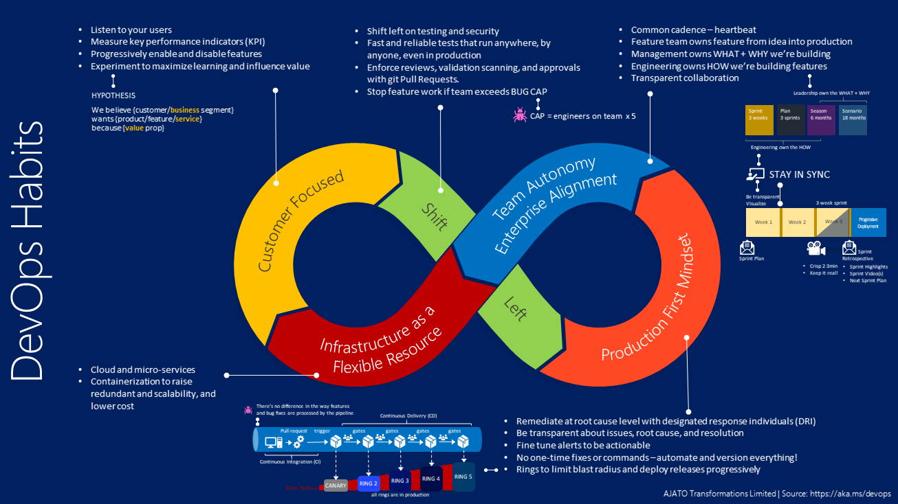
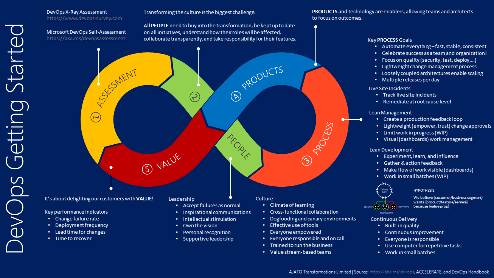
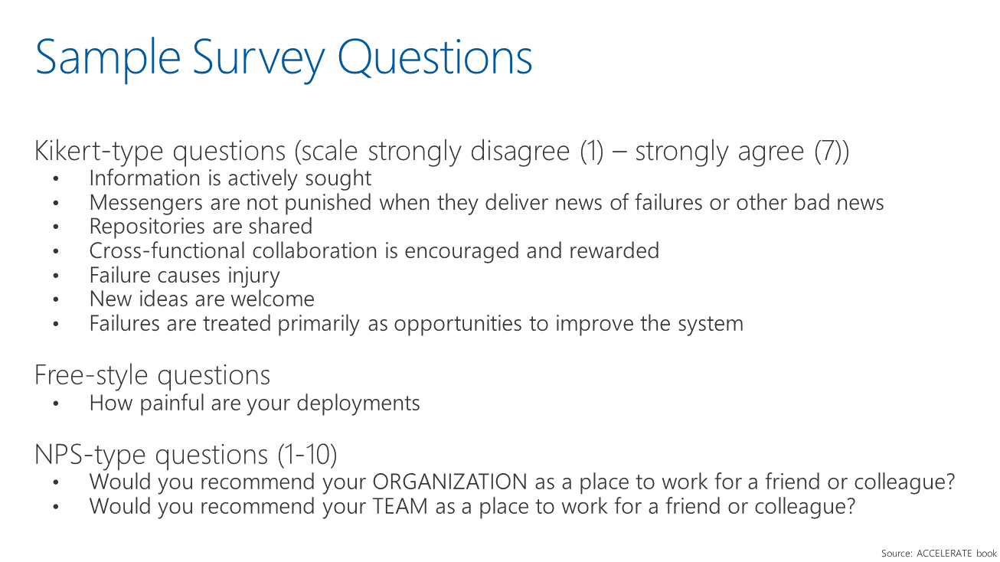
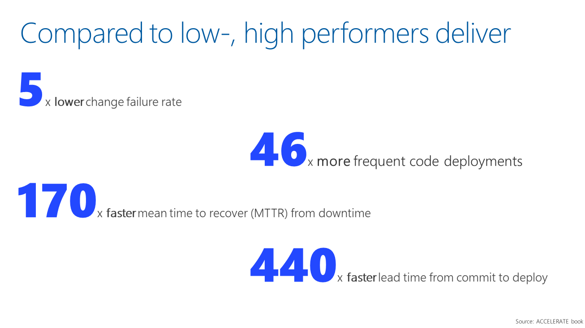
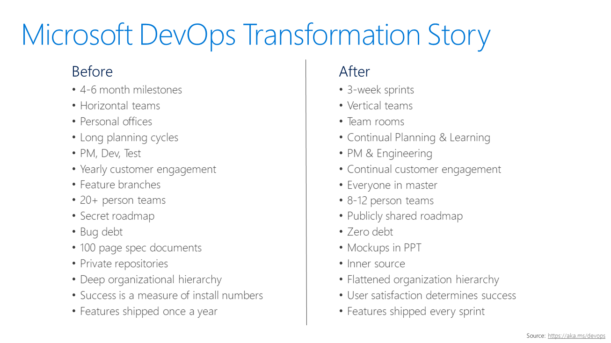
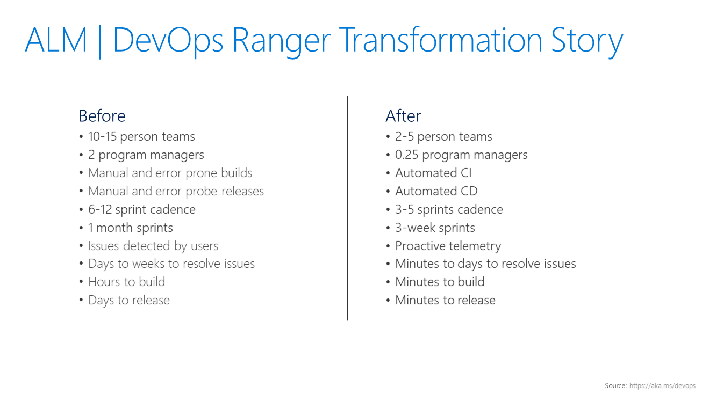
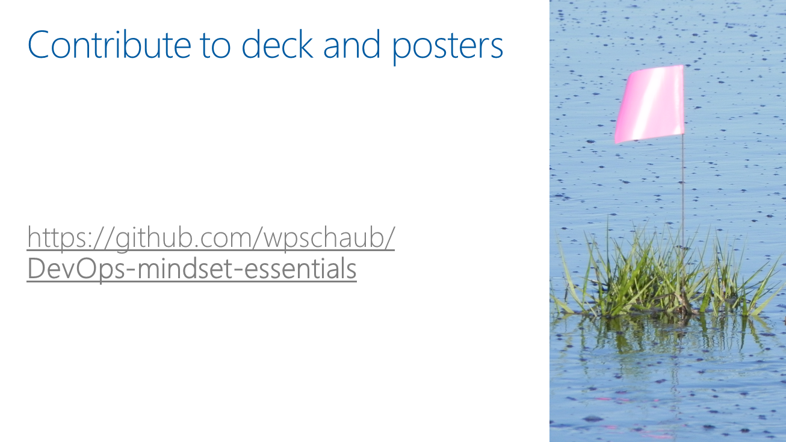
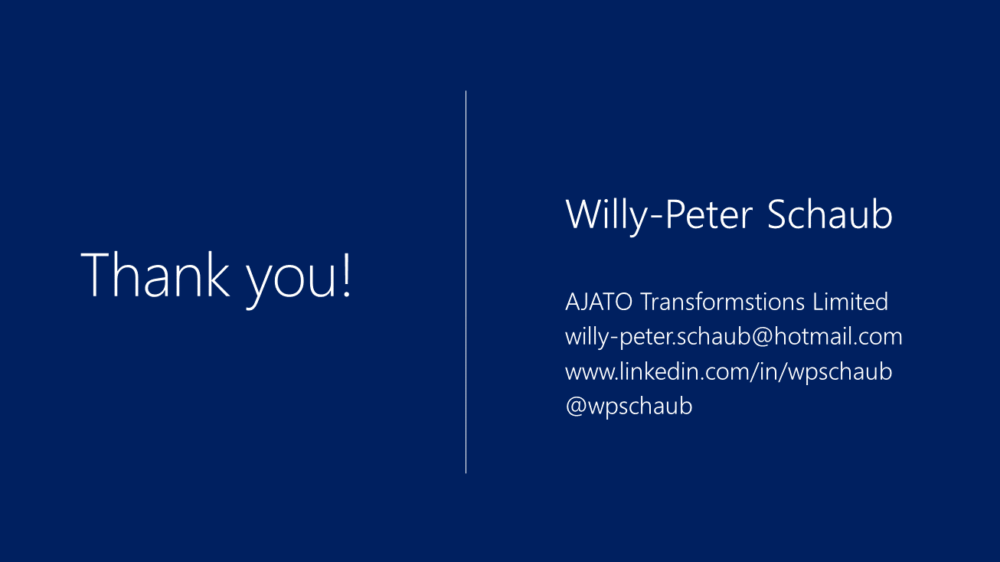

# DevOps mindset essentials

This file represents the sections, slides, and content for the DevOps mindset essentials created for the [GDBC](www.globaldevopsbootcamp.com) event.  

You can find the deck PDF [here](devops-mindset-essentials-gdbc.pdf)

## INTENT

---
### #1 - Deck intent

WHO IS YOUR AUDIENCE
- Users interested in embracing a DevOps mindset in their organization.

WHAT SHOULD YOUR AUDIENCE TAKE AWAY? (factual)
- They need to understand how we’re transforming, what we’re learning, and that we need to focus on PEOPLE, PROCESS, PRODUCTS … in that order.

WHAT DO YOU WANT YOUR AUDIENCE TO KNOW? (feeling)
- They need to leave with a positive feeling that they can rely on proven practices, real-world learnings, and that they are not alone.

HOW MUCH TIME DO YOU NEED?
- 25min for presentation ad 5min for [off-line] discussions and Q&A

## INTRODCTION

---
### #2 - Cover

DevOps mindset essentials

---
### #3-5 - Speaker

 
 

Willy-Peter Schaub
willy-peter.schaub@hotmail.com
@wpschaub

---
## DEVOPS ESSENTIALS
### #6 - DevOps Definition by Donovan Brown

DevOps is the union of people, process, and products to enable continuous delivery of value to our end users.

Donovan Brown
Microsoft
[twitter](@donovanbrown)
[reference](http://donovanbrown.com/post/what-is-devops)

---
### #7 - Definition of Done (DoD)

Live in production, collecting telemetry that examines the hypothesis which motivated the deployment.

From the Microsoft DevOps Story
[reference](https://aka.ms/devops)

---
### #8 - ACCELERATE book

Improvement Is Possible for Everyone!

If leadership provides consistent support.
+
Team members commit themselves to the work.

ACCELERATE book
[Amazon](https://t.co/smb82Y4i0M)

## POSTERS

---
### #9 - DevOps Practices

- CULTURE
  - Monitoring of running applications in production environments enables a DevOps team to detect issues as they occur, to mitigate the impact, and to understand the application health. Further monitoring of customer usage helps organizations form hypotheses and quickly validate or disprove experiments.
  - Top performers:
    - Foster a growth mindset.
    - Reward innovation 
    - Create a learning climate
    - Collaborate and experiment
    - User empathy
- PROCESS
  - The goal for modern application delivery is responsiveness, which relies on flexible scheduling, limiting work in process in favor of iterative experiments, and close team collaboration to facilitate real-time communication and eliminate wasteful handoffs. 
  - Top performers:
    - Go beyond cross-functional
    - Create multi-disciplinary teams
    - Allow autonomous teams to go fast
    - Align teams with enterprise objectives
    - Common product backlog
    - Minimize work in progress
    - Nimble and rigorous quality practices
- TECHNOLOGY
  - Products and technology are enablers, allowing teams and architects to focus on outcomes.
- MEASUREMENTS
  - Measurement is key to being able to assess performance and target improvement. Measurement allows you to see the state of the app in production, the flow from idea to code to delivery, and the actual usage of the features you produce. 
  - Key performance indicators:
    - Deployment frequency
    - Lead time for changes
    - Change failure rate
    - Time to recover 
- OUTCOMES
  - The point of DevOps is to achieve better outcomes. More frequent deployments allow you introduce new value more quickly. Higher deployment velocity gives you faster feedback on every change. Faster time to mitigate failures gives your users higher availability. More successful changes eliminate rework and let you go faster. All of these lead to more satisfied customers and more motivated employees.
  - Top performers:
    - Track live site incidents
    - Remediate at root cause level
    - Frequent deployments
    - Low change failure rate
    - Minimal time to recover 

[source](https://aka.ms/devopsassessment)

---
### #10 - DevOps Technology

- VERSION CONTROL
  - Version control enables teams located anywhere in the world to communicate effectively during daily development activities as well as to integrate with software development tools for monitoring activities such as deployments. 
  - Top performers:
    - Use topic branches for short-term isolation
    - Continuously merge changes into master
    - Review and audit using Git pull requests
    - Version everything
- TEST
  - Testing used to be a slow, infrequent activity. So slow, that testing cadence would determine a team's ability to release. DevOps strives for testing as a continuous activity, embedded into both the developer workflow and the pipeline used for continuous integration and continuous delivery
- CLOUD + INFRASTRUCTURE
  - Teams can use the Public and Hybrid Clouds to gain capacity on demand. With a well-managed cloud, your teams can provision resources as needed and move as fast as they need.
- CI / CD
  - Continuous Integration (CI) refers to the practice of triggering an automated build and test sequence with every commit of code changes. Continuous Delivery (CD) extends this to trigger further testing and the deployment to production, with approval if necessary. 
  - Top performers:
    - Enable teams to move features swiftly from idea into production
    - Create and validate release without impediments or manual rework.
- MONITORING
  - Monitoring of running applications in production environments enables a DevOps team to detect issues as they occur, to mitigate the impact, and to understand the application health. Further monitoring of customer usage helps organizations form hypotheses and quickly validate or disprove experiments. 
- PRODUCTS
  - ALM
    - Jira, Mingle, Trello, VSTS
  - ARTEFACT MNGT.
    - Azure, Bower, DockerHub, Nexus, npm, nuget, VSTS
  - CI
    - Bamboo, circlci, Jenkins, TeamCity, Travis CI, VSTS
  - CLOUD
    - AWS, Azure, Google Cloud
  - CONFIG MNGT.
    - Ansible, Chef, PowerShell DSC, puppet, Terraform, Vagrant
  - DATABASE
    - DBDeploy, DBmaestro, Redgate
  - DEPLOY
    - ElasticBox, JuJu, Octopus, Spinnaker, VSTS
  - FEATURE FLAGS
    - Feature Switcher, Feature Toggle, FlipIt, LaunchDarkly, NFeature 
  - KNOWLEDGE SHARE
    - Confluence, Markdown, Reddit, VSTS
  - MONITORING
    - Azure AI, elasticsearch, Nagios, splunk, ZABBIX
  - ORCHESTRATION
    - Docker Swarm, kubernetes, Mesophere, Mesos
  - SECURITY
    - Whitesource
  - TESTING
    - Jasmine, JUnit, Karma, QUnit, Selenium, specflow, xUnit
  - VERSION CONTROL
    - BitBucket, git, GitHub, GitLab, TFVC

[source](https://aka.ms/devopsassessment)

---
### #11 - DevOps Habits

- Customer Focused
  - Listen to your users
  - Measure key performance indicators (KPI)
  - Progressively enable and disable features
  - Experiment to maximize learning and influence value
- Shift Left
  - Shift left on testing and security
  - Fast and reliable tests that run anywhere, by anyone, even in production
  - Enforce reviews, validation scanning, and approvals with git Pull Requests.
  - Stop feature work if team exceeds BUG CAP
  - CAP = engineers on team x 5
- Production First Mindset
  - Remediate at root cause level with designated response individuals (DRI)
  - Be transparent about issues, root cause, and resolution
  - Fine tune alerts to be actionable
  - No one-time fixes or commands – automate and version everything!
  - Rings to limit blast radius and deploy releases progressively
- Team Autonomy and Enterprise Alignment
  - Common cadence – heartbeat
  - Feature team owns feature from idea into production
  - Management owns WHAT + WHY we’re building
  - Engineering owns HOW we’re building features
  - Transparent collaboration
- Infrastrcuure as a Flexible Resource
  - Cloud and micro-services
  - Containerization to raise redundant and scalability, and lower cost

[source](https://aka.ms/devops)

---
### #12 - DevOps Getting Started

- ASSESSMENT
  - DevOps X-Ray Assessment
    https://www.devops-survey.com  
  - Microsoft DevOps Self-Assessment
    https://aka.ms/devopsassessment 
- PEOPLE
  - Transforming the culture is the biggest challenge. 
  - All PEOPLE need to buy into the transformation, be kept up to date on all initiatives, understand how their roles will be affected, collaborate transparently, and take responsibility for their features.
  - Leadership
    - Vision
    - Inspirational communications
    - Intellectual stimulation
    - Supportive leadership
    - Personal recognition
  - Team Culture
    - Cross-functional collaboration
    - Climate of learning
    - Effective use of tools
    - Everyone is responsible
  - Culture
    - Value stream  based  teams
    - Dogfooding and canaries
    - Org trained  to  run  the  business  
    - Everyone empowered  
    - Everyone responsible and  on  call 
    - Everyone engaged in  the  team  
- PROCESS
  - Key PROCESS Goals
    - Focus on quality (security, test, deploy,…)
    - Loosely coupled architectures enable scaling
    - Lightweight change management process
    - Automate everything – fast, stable, consistent
    - Multiple releases per day
    - Celebrate success as a team and organization!
  - Live Site Incidents
    - Track live site incidents
    - Remediate at root cause level
  - Lean Management
    - Limit work in progress (WIP)
    - Visual (dashboards) work management
    - Create a production feedback loop
    - Lightweight (empower, trust) change approvals
  - Lean Development
    - Work in small batches (WIP)
    - Make flow of work visible (dashboards)
    - Gather & action feedback
    - Experiment, learn, and influence
  - Continuous Delivery
    - Built-in quality
    - Work in small batches
    - Use computer for repetitive tasks
    - Continuous improvement
    - Everyone is responsible
- PRODUCTS
  - PRODUCTS and technology are enablers, allowing teams and architects to focus on outcomes.
- VALUE
  - It’s about delighting our customers with VALUE!
  - Key performance indicators
    - Deployment frequency
    - Lead time for changes
    - Change failure rate
    - Time to recover 

[source](https://aka.ms/devops), ACCELERATE book, and DevOps Handbook

## EVIDENCE

---
### #13 - Sample Survey Questions

Kikert-type questions (scale strongly disagree (1) – strongly agree (7))
- Information is actively sought
- Messengers are not punished when they deliver news of failures or other bad news
- Repositories are shared
- Cross-functional collaboration is encouraged and rewarded
- Failure causes injury
- New ideas are welcome
- Failures are treated primarily as opportunities to improve the system

Free-style questions
- How painful are your deployments

NPS-type questions (1-10)
- Would you recommend your ORGANIZATION as a place to work for a friend or colleague?
- Would you recommend your TEAM as a place to work for a friend or colleague? 

---
### #14 - Where are you?

|2017 SURVEY|HIGH performers|MEDIUM performers|LOW performers|
|-----------|---------------|-----------------|--------------|
|Deployent Frequency|On demand, multiple per day|Between once per week and once per month|Between once per week and once per month|
|Lead Time for Changes|< one hour|Between one week and one month|Between one week and one month|
|MTTR|< one hour|< one day|Between one day and one week|
|Change Failure Rate|0 - 15%|0 - 15%|31 - 45%|

---
### #15 - Compared to low-, high performers deliver

5x lower change failure rate
46x more frequent code deployments
170x faster mean time to recover (MTTR) from downtime 
440x faster lead time from commit to deploy
Source: ACCELERATE book

---
### #16 - Microsoft DevOps Transformation Story

Before
-4-6 month milestones
- Horizontal teams
- Personal offices
- Long planning cycles
- PM, Dev, Test
- Yearly customer engagement
- Feature branches
- 20+ person teams	
- Secret roadmap
- Bug debt
- 100 page spec documents	
- Private repositories
- Deep organizational hierarchy
- Success is a measure of install numbers
- Features shipped once a year

After
- 3-week sprints
- Vertical teams
- Team rooms
- Continual Planning & Learning
- PM & Engineering
- Continual customer engagement
- Everyone in master
- 8-12 person teams
- Publicly shared roadmap
- Zero debt
- Mockups in PPT
- Inner source
- Flattened organization hierarchy
- User satisfaction determines success
- Features shipped every sprint

Source: https://aka.ms/devops 

---
### #17 - ALM | DevOps Ranger Transformation Story

Before
- 10-15 person teams
- 2 program managers
- Manual and error prone builds
- Manual and error probe releases
- 6-12 sprint cadence
- 1 month sprints
- Issues detected by users
- Days to weeks to resolve issues
- Hours to build
- Days to release

After
- 2-5 person teams
- 0.25 program managers
- Automated CI
- Automated CD
- 3-5 sprints cadence
- 3-week sprints
- Proactive telemetry
- Minutes to days to resolve issues
- Minutes to build
- Minutes to release

Source: https://aka.ms/devops 

## Q&A + CLOSE

---
### #18 - Contribute to this deck and posters

[GutHub Repo](https://github.com/wpschaub/DevOps-mindset-essentials) 

---
### #19 - References

[aka.ms/devops](https://aka.ms/devops) DevOps @ Microsoft story

[aka.ms/vsar-rings](https://aka.ms/vsar-rings) Ring article

[aka.ms/vsar-flags](https://aka.ms/vsar-flags) Feature flag article

[aka.ms/vsar-rings-flags](https://aka.ms/vsar-rings-flags) Rings or flags article

[aka.ms/vsar-pipes](https://aka.ms/vsar-pipes) ALM | DevOps Rangers CI/CD Pipelines

---
### #20 - Thank you

Willy-Peter Schaub
willy-peter.schaub@hotmail.com
@wpschaub